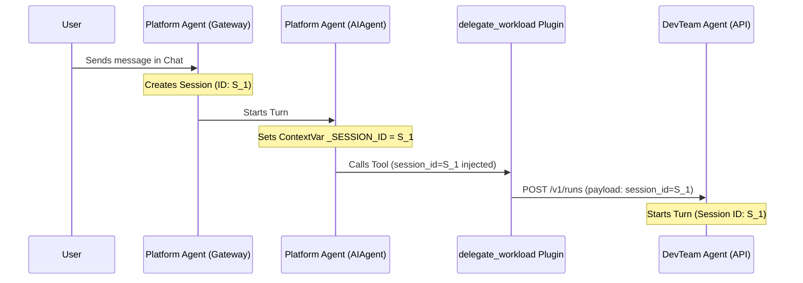
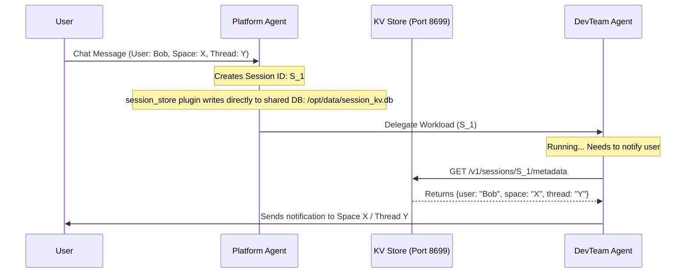

# Cross-Agent Workload Delegation and Session Propagation (`delegate_workload`)

This document describes the design, implementation, and rationale behind the `delegate_workload` plugin used to coordinate tasks between the **Platform Coordinator** and worker agents (**Operator** and **DevTeam**).

---

## 1. Background & The Session Tracking Challenge

In our cooperative multi-agent architecture, the **Platform Agent** receives user instructions from chat channels (Google Chat) and delegates operational tasks (e.g., bugfixes, deploys, cluster capacity audits) to specialized downstream worker agents.

To ensure unified tracing, proper message routing, and security boundaries, **every action executed by worker agents must be correlated with the original user chat session.** This correlation is managed via a unique transaction identifier: the `session_id`.

Propagating this `session_id` across the network boundary from the Platform Agent to the worker agents presented significant technical hurdles.

---

## 2. Why Alternative Approaches Failed

Before implementing the native python plugin, we attempted to handle delegation using standard harness features: shell-script skills and out-of-process MCP tools. Both failed due to environment boundaries:

### Attempt 1: Shell-Script Skills (Terminal Tool)
*   **The Approach:** We created a markdown skill instructing the agent to run a shell script (`provision_devteam.sh`) via the standard `terminal` tool.
*   **Why it Failed:** 
    *   The `terminal` tool executes commands in an isolated subprocess shell.
    *   The harness uses a terminal snapshotting mechanism that caches environment variables. Dynamic, transient variables (like the current turn's `session_id`) were not propagated to the subprocess.
    *   This "environment pollution" caused the subprocess to either lose the session context entirely or inherit a stale session ID from a previous conversation turn.

### Attempt 2: Standard MCP Tools
*   **The Approach:** We exposed delegation actions as tools on a standalone MCP server.
*   **Why it Failed:**
    *   MCP servers run as separate processes and communicate with the agent via stdin/stdout or HTTP/SSE.
    *   Because they run out-of-process, they have no visibility into the parent Python framework's thread-local memory or `ContextVar` store (where the active `session_id` is maintained).
    *   To propagate the session ID, we would have had to modify the schema of every delegation tool to accept an explicit `session_id` argument. This would expose the session ID to the LLM's token space, increasing token usage and relying on the LLM to correctly copy and paste the ID on every tool call.

---

## 3. The Solution: Native Python Plugin (`delegate_workload`)

To bypass process boundaries and shell isolation, we developed `delegate_workload` as a **native python plugin** located at [agents/platform/plugins/delegate_workload/](agents/platform/plugins/delegate_workload/).

A Python-based plugin runs **in-process** within the Hermes core container. This allows it to tap directly into the active Python execution context:



### ContextVar Injection
The Platform Agent framework maintains the active session ID inside a thread-safe `ContextVar` (`_SESSION_ID`) for the duration of the conversation turn. 

When the ADK tool executor registers the `delegate_workload` handler, it detects that the method signature contains a `session_id` argument. The framework automatically extracts the value of the active `_SESSION_ID` ContextVar and injects it directly into the plugin call, completely bypassing the LLM.

### Direct Network Delivery
The plugin bypasses subprocesses and calls the downstream worker's API server (`/v1/runs`) directly using Python's `urllib`. The payload is structured as follows:

```json
{
  "prompt": "[SWARM DELEGATION DISPATCH] You have been delegated the following task...",
  "session_id": "20260619_164947_5f68e9a6"
}
```

Additionally, it propagates the ID in the HTTP headers:
```http
X-Hermes-Session-Id: 20260619_164947_5f68e9a6
```

---

## 4. Downstream Context Registration

On the receiving side (e.g. the DevTeam Agent's API server):
1.  The incoming request is parsed by the Hermes HTTP endpoint.
2.  The server extracts the `session_id` from the JSON payload or the `X-Hermes-Session-Id` header.
3.  Before starting the conversational execution loop for the delegated task, the server initializes the thread context and binds the received `session_id` to its own local `_SESSION_ID` ContextVar.
4.  All logs, tool executions, and LLM calls executed by the worker agent are now recorded under this session ID, enabling end-to-end trace correlation.

---

## 5. Metadata KV Store & Chat Egress

Certain metadata (such as the Google Chat/Slack space ID, thread ID, and the LDAP of the user who triggered the message) are **only available in the initial webhook message received by the Platform Agent.** 

Downstream worker agents do not have access to this chat webhook data, but they must be able to write log updates, thoughts, and notifications back to the original chat thread.

To solve this, we implemented a **Session KV Store** (`session_store` plugin):



1.  **State Insertion:** When the Platform Agent receives a chat message, it generates the `session_id` and the `session_store` plugin immediately writes a record directly into the shared SQLite database `/opt/data/session_kv.db`:
    *   `session_id` (Key)
    *   `user_email`
    *   `google_chat_id`
    *   `google_thread_id`
    *   `KUBERNETES_SERVICE_HOST` (Captured from environment)
2.  **State Resolution:** When the DevTeam or Operator agent needs to emit a thought or alert back to the user, it queries the KV Store resolver endpoint (`http://platform-agent.agent-system.svc.cluster.local:8699/v1/sessions/{session_id}/metadata`) using its active `session_id`.
3.  **Chat Routing:** The resolver returns the space and thread metadata. The worker agent then sends its message directly to the correct channel via webhook.
4.  **Future Governance:** This architecture allows us to implement **fine-grained user access control**. The Platform Agent can verify if the user LDAP stored in the KV metadata for the active `session_id` is authorized to perform the high-privilege actions requested by the worker agent.
